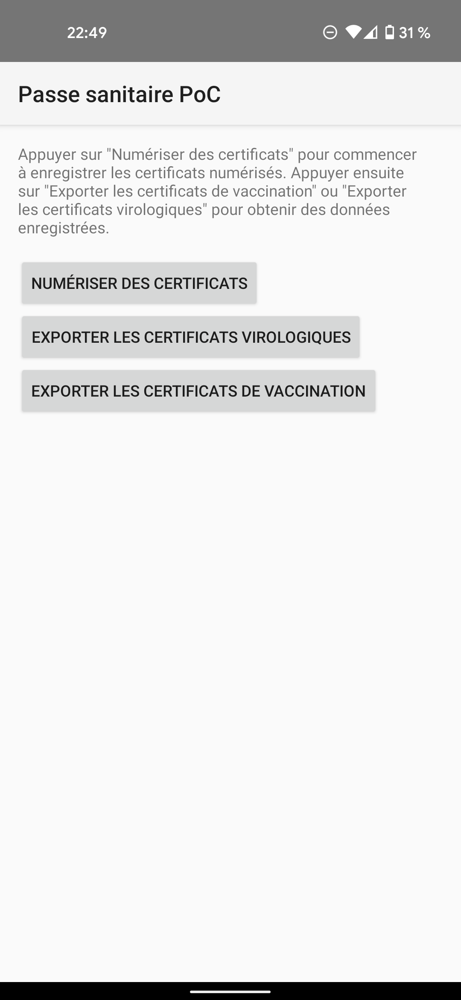
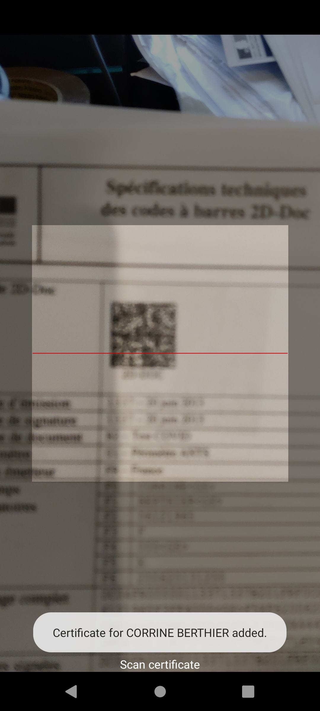

Pass sanitaire PoC
==================

This PoC shows how easy it is to misuse data of French digital certificates
for covid-19, using the French or European format.

EU certificates from other countries than France should be detected too (not
tested).




This app scans digital certificates, extracts data, and saves it to a CSV
file.

Specs of French digital certificates are available here:
https://ants.gouv.fr/content/download/516/5665/version/11/file/Specifications-techniques-des-codes-a-barres_2D-Doc_v3.1.3.pdf

Specs of European certificates are available here:
https://github.com/ehn-dcc-development/ehn-dcc-schema

Java library used to parse European certificates:
https://github.com/DIGGSweden/dgc-java

In France, testing centers can be found from their code here:
https://www.data.gouv.fr/fr/datasets/sites-de-prelevements-pour-les-tests-covid/

## WARNING WARNING WARNING

This app is only a PoC to show how French and European digital certificates are
broken. DO NOT USE THIS APP TO CREATE ILLEGAL FILES OF PERSONAL DATA. SUCH
ILLEGAL FILES ARE PUNISHED IN FRANCE WITH A €45.000 FINE AND ONE-YEAR PRISON
SENTENCE.

## Build

```bash
./gradlew assembleDebug
```

APK can then be found in `app/build/outputs/apk/debug/app-debug.apk`.

## License

MIT

## SOURCES

https://git.laquadrature.net/bastien/pass-sanitaire-poc
