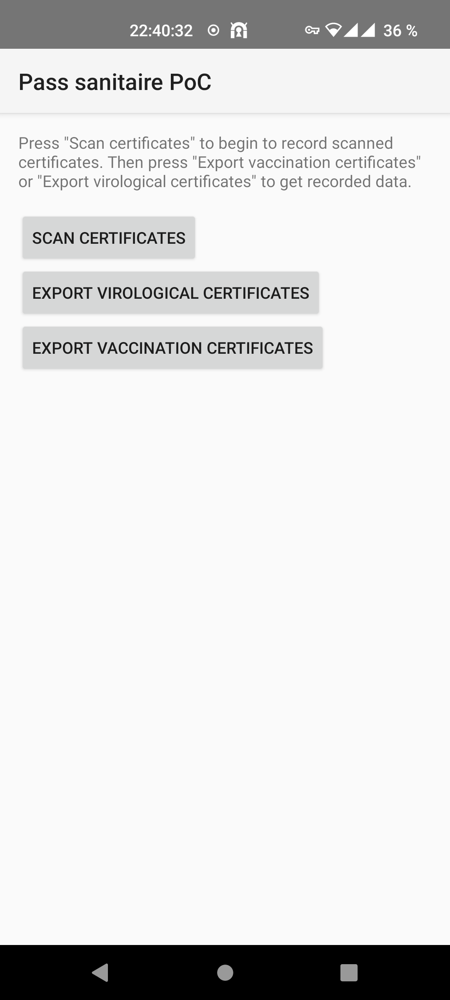

Pass sanitaire PoC
==================

This PoC shows how easy it is to misuse data of French digital certificates
for covid-19.




This app scans digital certificates, extracts data, and saves it to a CSV
file.

Specs of French digital certificates are available here:
https://ants.gouv.fr/content/download/516/5665/version/11/file/Specifications-techniques-des-codes-a-barres_2D-Doc_v3.1.3.pdf

Example of certificates can be found on pages 143 and 144.

## WARNING WARNING WARNING

This app is only a PoC to show how French digital certificates are broken. DO
NOT USE THIS APP TO CREATE ILLEGAL FILES OF PERSONAL DATA. SUCH ILLEGAL FILES
ARE PUNISHED WITH A €45.000 FINE AND ONE-YEAR PRISON SENTENCE.

## Build

```bash
./gradlew assembleDebug
```

APK can then be found in `app/build/outputs/apk/debug/app-debug.apk`.

## License

MIT
